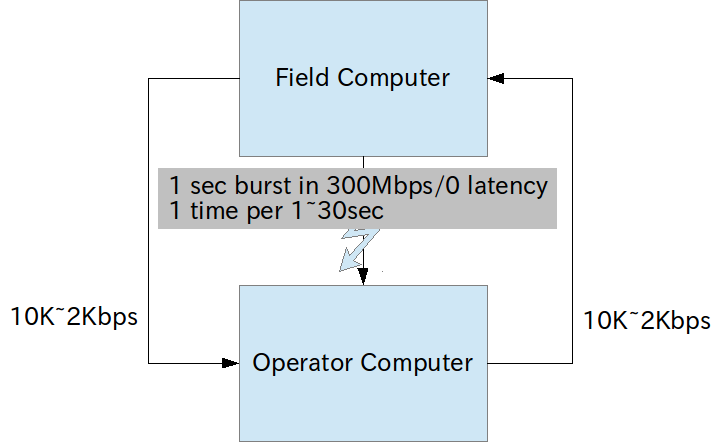

# DRCでのネットワークについて
本ドキュメントは[DRC Finals Rules](http://www.theroboticschallenge.org/sites/default/files/2014_12_3_Comms_Doc_For_Teams_DISTAR_Case_23912.pdf)に基づいたものである。

## ルール概要

大きく分けて5つの領域に計算機を置くことが可能。その間の通信は制限される。
1. Robot
2. Field Computer
3. Operator Computor
4. Operator Cloud

特に2と3の間で提供される通信は特殊である。

* (0~1023 port) 常時2と3へ10kbpsから2kbpsの間の通信, 遅延についての記述はなし
* (16384~24575 port) 3から4へ、1Gbps, 遅延なしの通信。
ただしこれは300Mbitの"burst"通信が1秒から30秒の間で
ランダムに通信可能になる。

この２つはポートによって切り分けられる。また、ICMP(ping)は上の常時接続された
経路を通る.

# ネットワーク通信量
## プロトコル
### TCP/IP
TCP/IPはハンドシェイクが必要となるプロトコルである。
つまり計算機AからBへパケットPを通信したい時、AからBへパケットPを送るだけではなく、
BからACKと呼ばれる返答パケットが返ってこなくてはいけない。

この場合、通信遅延は双方向の和となる。

例えばAからBへの経路に遅延が1秒、BからAへの経路に遅延が1秒であった場合、遅延は2秒となる.

### UDP
UDPはハンドシェイクを必要としない。ただし、信頼できる通信を実装するには、自分で
ACKのような確認パケットを送る仕組みを用意しなくてはいけない。

## 通信量の観点から
10kbpsは厳しい帯域制限である。

---
以下に各種データに関してそのサイズの大きさを示す。これらは理論値であり、実際に通信するときは
各パケットに対しヘッダが付与される。

* データ量比較

Data Type                      | Data Size(bit)     | Num per sec in 10kbps | Num per sec in 2kbps
-------------------------------|--------------------|-----------------------|---------------------
Image (RGB,VGA)                | `640*480*3*8=7.2M` | 0.001                 | 0.0003
Image (RGB,QVGA)               | `320*240*3*8=1.8M` | 0.006                 | 0.001
Image (Mono,VGA)               | `640*480*1*8=2.4M` | 0.004                 | 0.0008
Image (Mono,QVGA)              | `320*240*1*8=0.6M` | 0.02                  | 0.003
Image (Mono,20x20)             | `20*20*8=0.4K`     | 3                     | 0.625
Image (Mono,10x10)             | `10*10*8=0.1K`     | 12                    | 2.5
Float                          | `32`               | 300                   | 62.5
Angle Vector (32 Float array)  | `1024`             | 9                     | 2
Bool                           | `1`                | 9600                  | 2000
Int                            | `64`               | 150                   | 31
OK-Warn-Error Status           | `2`                | 4800                  | 1000
Character                      | `8`                | 1200                  | 250
